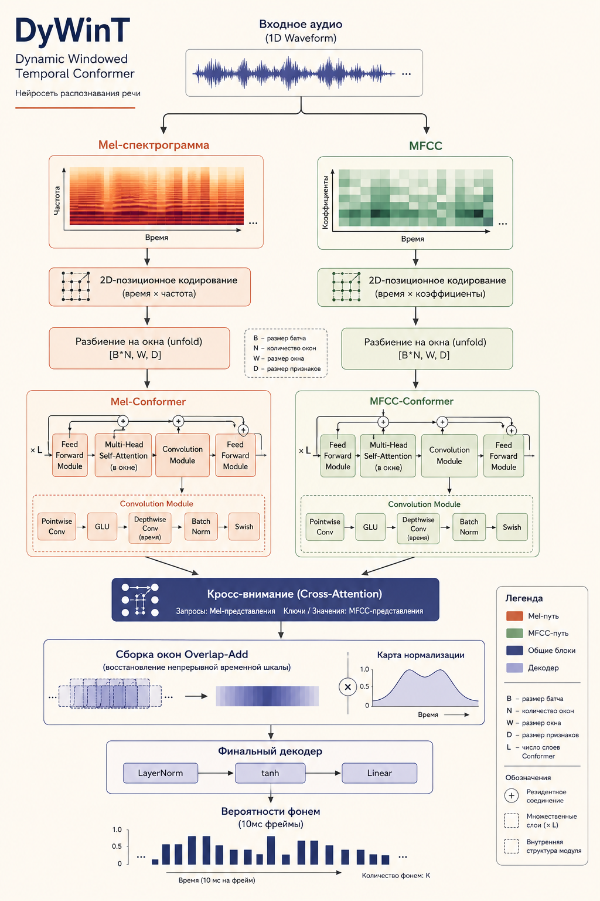

# DyWinT: Dynamic Windowed Temporal Conformer

Репозиторий содержит **DyWinT** — специализированную реализацию архитектуры Conformer (Convolution-augmented Transformer) для распознавания фонем из аудиопотока в реальном времени с высоким временным разрешением (до 10 мс).

Модель берет лучшее от Conformer (сочетание глобального внимания трансформеров и локальных признаков сверток), но решает проблему контекста на стыках прямо внутри нейросети, избавляя от необходимости нарезать аудиофайлы на этапе предобработки.



---

## Часть 1. Быстрый старт (для демонстрации)

Этот раздел предназначен для быстрого запуска и проверки проекта на любом компьютере без скачивания гигабайтных датасетов Common Voice с Hugging Face.

### Как запустить демо за 3 шага:

**1. Соберите окружение:**
Убедитесь, что у вас установлен менеджер пакетов `uv`. Запустите установку зависимостей под стабильный Python 3.12 [4]:
```bash
uv sync --python 3.12
```

**2. Запустите симуляцию обучения (Mock-режим):**
В этом режиме скрипт не требует наличия реального звука на диске. Он автоматически сгенерирует синтетический шум в оперативной памяти и прогонит его через полный цикл обучения на 3 эпохах:
```bash
uv run python src/main.py
```
*Вы увидите, как инициализируются Conformer-энкодеры, кросс-внимание и запускается лосс CTC.*

**3. Запуск реального обучения:**
Если у вас есть скачанный датасет Common Voice (в формате аудиоклипов и `.tsv` разметки), укажите пути в `configs/dataset/real.yaml` и запустите рабочую сессию [1]:
```bash
uv run python src/main.py dataset=real mode=prod
```

---

## Лицензия и вклад
Проект разработан в исследовательских целях для создания высокоточных систем акустического выравнивания (Forced Alignment). Вопросы по архитектуре и оптимизациям можно задать в разделе Issues.
```